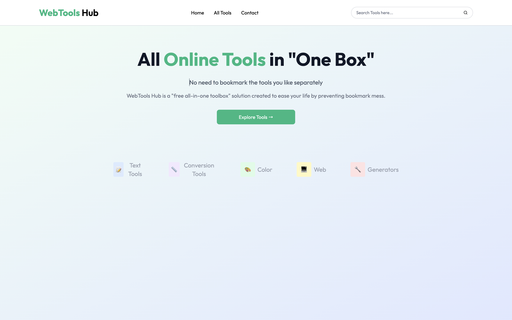
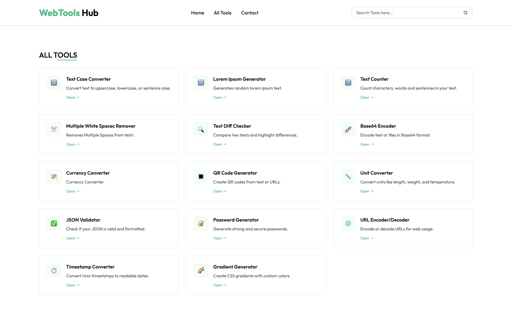

# ⚙️ WebTools Hub

A modern, fully responsive web platform offering real-world productivity tools like converters, generators, and utilities — all in one place.

 

---

## 🚀 Features

### 🧠 Text Utilities
- 🔠 **Text Case Converter** – Convert text to Sentence, Title, Lower, Upper, Mixed, and Inverse cases.
- ✍️ **Lorem Ipsum Generator** – Generate paragraphs with custom sentence/word count.
- 📊 **Text Counter** – Real-time character, word, and sentence counter.
- 🧹 **Multiple Space Remover** – Cleans up extra white spaces in text.

### 💱 Converters
- 💸 **Currency Converter** – Live conversion using free exchange rate API.
- 📏 **Length Converter** – Metric and imperial units, unit descriptions, swap functionality.
- ⚖️ **Mass Converter** – Common mass/weight unit conversions.
- 📐 **Area Converter** – Converts between standard area units.
- 🕒 **Time Converter** – Supports ms, seconds, minutes, hours, days, weeks, and years.
- 🌡️ **Temperature Converter**
  - Copy result to clipboard
  - Live conversion chart (Recharts)
  - Emoji and color indicators for cold/hot

### 🖼️ Media Tools
- 🔲 **QR Code Generator**
  - Generate QR codes
  - Export as PNG/JPEG

### 🔒 Utilities
- 🔐 **Password Generator**
  - Adjustable length and character rules
  - Strength indicator
  - Copy to clipboard

---

## 🛠️ Tech Stack

- **Frontend**: React.js, Vite
- **Styling**: Tailwind CSS
- **Routing**: React Router
- **Dropdowns**: React Select
- **Charts**: Recharts
- **APIs**: ExchangeRate API, Native Web APIs (Clipboard, File, etc.)

---

## 📱 Responsive Design

All tools are fully mobile-friendly and responsive across all screen sizes using Tailwind’s utility-first design system.

---
